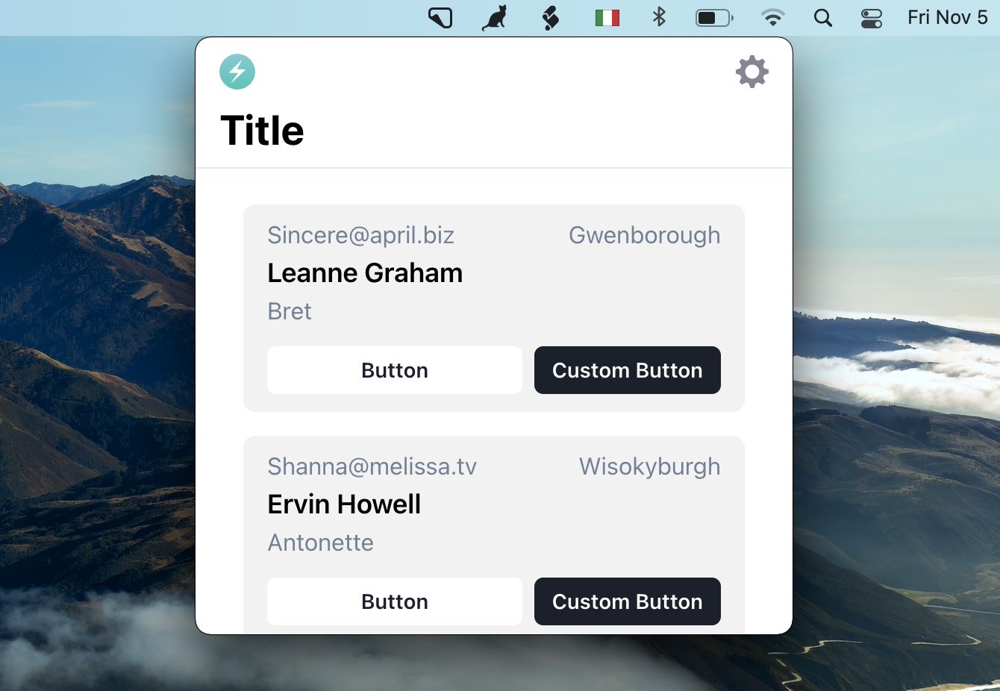

# Electron Chakra UI Starter

Boilerplate for using Chakra UI in an ElectronJS app.



## Steps
* Clone the repo into a folder
* Install dependencies with `npm install` or `yarn`
* Open two terminal windows on your folder's path (in VSCode just press the + button on the terminal panel to open another one)
* Run `yarn watch` on one terminal window (this will create the bundle with Webpack)
* Run `yarn start` on the other (this will open the Electron app on your status bar)
* Refresh to see changes in your code (PRs for implementing hot reload are welcome)

## Usage
After cloning the repo run install the dependencies with yarn or npm
```
npm install
```
or
```
yarn
```
Webpack has to bundle together all the javascript and React files before Electron can start the app so you'll have to have to terminal windows opened, if you're using VSCode it looks like this


```
if (isAwesome){
  return true
}
```
